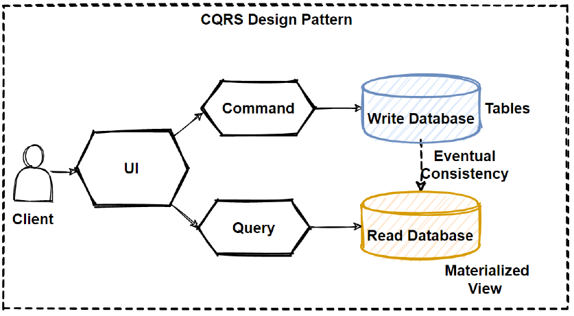

# cqrs-layout-example



### Overview

> CQRS stands for Command and Query Responsibility Segregation, a pattern that separates read and update operations for a data store.

This project is example of cqrs pattern implementation on golang.
Can be used as project starter for crud based applications.
You just need to replace entity_name with your own domain entity

### Layout features

* Hexagonal architecture
* DTO (Data Transfer Object) for request and response
* DDD (Domain Driven Design) for domain entity
* CQRS (Command Query Responsibility Segregation) for separation of read and write operation (replication support)

### Config example

To use this example you need to create `./config/config.yaml` and fill it with:

```yaml
Postgres:
  Host: localhost
  Port: 5432
  User: root
  Password: dev
  DBName: postgres
  SSLMode: true
  Driver: pgx
  Settings:
    MaxOpenConns: 25
    MaxIdleConns: 25
    ConnMaxLifetime: 300000
    ConnMaxIdleTime: 300000

Jaeger:
  URL: http://localhost:14268
  ServiceName: cqrs-layout-example
  TracerName: cqrs-layout-example
  Password: root
  Username: dev
```